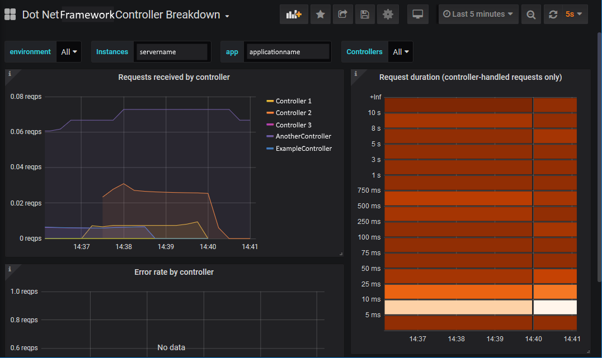
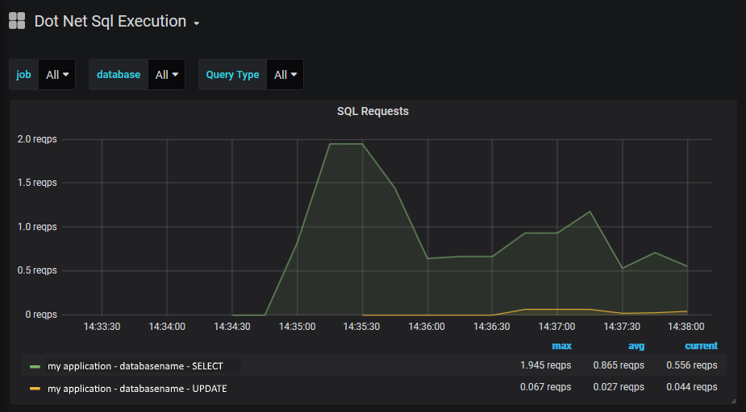

# prometheus-net.AspNet
A plugin for the [prometheus-net](https://github.com/prometheus-net/prometheus-net) package, exposing ASP.NET full framework metrics. Basic Auth can also be enabled for the endpoint. Can also collect metrics on SQL database calls if using Entity Framework 6.




# Movidesk pack and publish
```
https://www.youtube.com/watch?v=xPm9FsptuE8
nuget pack
nuget push movidesk-prometheus-net.AspNet.x.x.x.nupkg personal_github_token -Source github
```

# Installation

Add the package from [nuget](https://www.nuget.org/packages/prometheus-net.AspNet):
>Install-Package: [prometheus-net.AspNet](https://www.nuget.org/packages/prometheus-net.AspNet)

If you are using Entity Framework 6 and wish to collect SQL metrics: [nuget](https://www.nuget.org/packages/prometheus-net.EF):
>Install-Package: [prometheus-net.EF](https://www.nuget.org/packages/prometheus-net.EF)

# Usage

To publish your metrics, call `UseMetricsServer` inside your WebApiConfig.Register method, and specify the endpoint. The following code will expose http://localhost/metrics  

```csharp
public static class WebApiConfig
{
    public static void Register(HttpConfiguration config)
    {
        ...

        PrometheusConfig.UseMetricsServer(config, "metrics");
    }
}
```

If you wish to enable Basic Auth protection for your endpoint, pass through the basic auth username and password when calling `UseMetricsServer`:
```csharp
public static class WebApiConfig
{
    public static void Register(HttpConfiguration config)
    {
        ...

        PrometheusConfig.UseMetricsServer(config, "metrics", "BasicAuthUsername", "BasicAuthPassword");
    }
}
```

# ASP.NET HTTP request metrics

A HTTP Module is included that exposes some metrics from ASP.NET applications:

* Number of HTTP requests in progress.
* Total number of received HTTP requests.
* Duration of HTTP requests.

To include these metrics edit your `global.asax.cs` and add the following lines:
```csharp
public class MvcApplication : System.Web.HttpApplication
{
    public static IHttpModule Module = new Prometheus.AspNet.PrometheusHttpRequestModule();

    public override void Init()
    {
        base.Init();
        Module.Init(this);
    }
```

These metrics include labels for HTTP status code (eg, 200), HTTP method (eg, POST), Controller and Action.

# Entity Framework 6 SQL Metrics

A DbCommandInterceptor has been written to track SQL query performance.

To use, add a DbConfigurationType attribute to your DbContext and specify the PrometheusEF6CodeConfig class:

```csharp
[DbConfigurationType("Prometheus.EF.PrometheusEF6CodeConfig, Prometheus.EF")]
public partial class MyDbContext : DbContext
{
	....
}
```

These metrics include SQL timing information and the following labels:

* database - the DB that the query was executed against
* querytype - INSERT, SELECT, UPDATE or DELETE (or empty if not known)
* success - either "true" or "false" indicating query was successful
	
	
